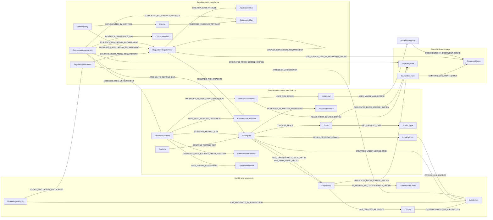

# Counterparty Risk + Cross-Jurisdiction Compliance Graph POC

This package defines a Neo4j property-graph model that connects counterparty exposure analytics to global standards, local requirements, internal controls, evidence, legal opinions, and banking source-system lineage.

The central design choice is to make `NettingSet` the operational bridge. A netting set connects the bank and counterparty legal entities, trades, agreements, collateral, jurisdiction, risk measurements, legal opinions, and compliance assessments. That gives the POC a deterministic path from a regulatory clause to the risk number and source records affected by it.

## Deliverables

- `01-schema.cypher`: idempotent constraints, lookup indexes, full-text indexes, and an optional vector-index template.
- `02-sample-data.cypher`: idempotent public-source and synthetic seed graph.
- `03-poc-queries.cypher`: nine demonstration queries covering regulatory mapping, exposure aggregation, private-credit analysis, evidence traceability, impact analysis, GraphRAG grounding, and lineage.

## Combined logical schema



## Query-first business questions

The model is designed to answer these questions without application-side joins:

1. Which EU, UK, and US requirements implement a given Basel requirement, and what differences were recorded during mapping?
2. What is the aggregate EAD for a connected counterparty group across booking entities and jurisdictions, and has it breached its approved limit?
3. For a private-credit trade, what are the counterparty rating, EAD, market sensitivity, balance-sheet carrying value, and compliance status?
4. Why is a specific EAD number present? Which netting set, model version, assumptions, input systems, requirement, assessment, and source text support it?
5. Which netting sets rely on missing or stale legal opinions, and which counterparty, branch, agreement, and jurisdictions are affected?
6. If a Basel or local requirement changes, which policies, controls, evidence, assessments, counterparties, and netting sets require review?
7. Can a GraphRAG answer return both the public regulatory source text and the bank-specific evidence path that grounds the answer?

## Modeling conventions

| Element | Convention | Example |
|---|---|---|
| Node label | Singular, plain-English `CamelCase` noun | `RegulatoryRequirement`, `BalanceSheetPosition` |
| Relationship type | Specific verb phrase in `UPPER_SNAKE_CASE` | `ASSESSES_REGULATORY_REQUIREMENT` |
| Property | Plain-English `camelCase` | `effectiveFrom`, `probabilityOfDefault` |
| Business key | Label-specific semantic key, never a generic `id` | `nettingSetId`, `regulatoryRequirementId` |
| Direction | Readable as a sentence from left to right | `NettingSet RELIES_ON_LEGAL_OPINION LegalOpinion` |
| Abbreviation | Stored as a property, not used as the only node name | `name: 'Exposure at default', abbreviation: 'EAD'` |
| Time-varying fact | Separate immutable observation node | `RiskMeasurement`, `ComplianceAssessment`, `CollateralPosition` |
| Many-party fact | Intermediate node instead of relationship overloading | `NettingSet`, `RiskCalculationRun`, `BalanceSheetPosition` |
| Provenance | Explicit relationship to `SourceSystem` with source record key | `ORIGINATES_FROM_SOURCE_SYSTEM {sourceRecordId: ...}` |

This follows Neo4j's published guidance to start with application questions, use business primary keys, add uniqueness constraints and lookup indexes, and prefer specific relationship names over generic connections.

## Node catalog

### Identity, ownership, jurisdiction, and provenance

| Node | Business key | Core properties | Typical source |
|---|---|---|---|
| `LegalEntity` | `legalEntityId` | `legalName`, `lei`, `entityType`, `entityStatus` | Party master, GLEIF |
| `CounterpartyGroup` | `counterpartyGroupId` | `name`, `groupingBasis` | Credit-risk group hierarchy |
| `Country` | `code` | `isoAlpha3`, `name` | ISO-backed reference table |
| `Jurisdiction` | `jurisdictionId` | `name`, `jurisdictionType` | Regulatory inventory |
| `RegulatoryAuthority` | `regulatoryAuthorityId` | `name`, `authorityType` | Regulatory inventory |
| `OrganizationalUnit` | `organizationalUnitId` | `name` | HR / GRC organization hierarchy |
| `SourceSystem` | `sourceSystemId` | `name`, `dataDomain` | Data catalog / CMDB |

### Risk, trading, collateral, credit, and finance

| Node | Business key | Core properties | Typical source |
|---|---|---|---|
| `Portfolio` | `portfolioId` | `name`, `businessUnit`, `bookingModel` | Trade capture / risk hierarchy |
| `NettingSet` | `nettingSetId` | `name`, `status`, `nettingRecognitionStatus` | CCR engine / legal agreement master |
| `Trade` | `tradeId` | `tradeDate`, `maturityDate`, `notionalAmount`, `fairValueAmount`, `privateCreditIndicator` | Trade capture |
| `ProductType` | `productTypeId` | `name`, `assetClass`, `regulatoryProductClass` | Product taxonomy |
| `MasterAgreement` | `masterAgreementId` | `agreementType`, `governingLaw`, `executionStatus` | Contract lifecycle management |
| `CollateralAgreement` | `collateralAgreementId` | `marginFrequency`, `thresholdAmount`, `minimumTransferAmount` | Collateral / contract system |
| `LegalOpinion` | `legalOpinionId` | `opinionStatus`, `opinionDate`, `reviewDueDate`, `conclusion` | Legal document repository |
| `CollateralAsset` | `collateralAssetId` | `name`, `assetType` | Security master / collateral system |
| `CollateralPosition` | `collateralPositionId` | `marketValueAmount`, `haircutAmount`, `asOfDate` | Collateral system |
| `Currency` | `code` | `name` | Reference data |
| `RiskFactor` | `riskFactorId` | `name`, `riskFactorType` | Market-data master |
| `RiskMeasureDefinition` | `riskMeasureDefinitionId` | `name`, `abbreviation`, `unitType`, `aggregationBehavior` | Risk taxonomy |
| `RiskMeasurement` | `riskMeasurementId` | `value`, `asOfDate`, `measurementBasis` | CCR / market / treasury risk engine |
| `RiskCalculationRun` | `riskCalculationRunId` | `name`, `asOfDate`, `runStatus`, `completedAt` | Risk orchestration platform |
| `RiskModel` | `riskModelId` | `name`, `modelType`, `version`, `approvalStatus` | Model inventory |
| `ModelAssumption` | `modelAssumptionId` | `name`, `assumptionValue`, `unit`, `sourceType`, `validFrom` | Model document / assumption inventory |
| `StressScenario` | `stressScenarioId` | `name`, `scenarioType` | Stress-testing platform |
| `RiskLimit` | `riskLimitId` | `name`, `thresholdValue`, `limitStatus`, `validFrom` | Limit management |
| `CreditAssessment` | `creditAssessmentId` | `internalRating`, `probabilityOfDefault`, `watchListStatus`, `asOfDate` | Credit workflow |
| `BalanceSheetPosition` | `balanceSheetPositionId` | `carryingValueAmount`, `asOfDate`, `balanceSheetSide` | General ledger / balance-sheet hub |
| `AccountingClassification` | `accountingClassificationId` | `name`, `accountingStandard` | Finance accounting policy |
| `GeneralLedgerAccount` | `generalLedgerAccountId` | `accountNumber`, `name`, `chartOfAccounts` | General ledger |

### Regulation, policy, control, and evidence

| Node | Business key | Core properties | Typical source |
|---|---|---|---|
| `RegulatoryInstrument` | `regulatoryInstrumentId` | `name`, `instrumentType`, `versionLabel`, `status`, `sourceUrl`, `effectiveFrom` | Regulatory inventory / public source |
| `RegulatoryRequirement` | `regulatoryRequirementId` | `referenceCode`, `title`, `requirementText`, `requirementType`, effective dates | Regulatory obligations register |
| `RiskTopic` | `riskTopicId` | `name`, `description` | Enterprise risk taxonomy |
| `ApplicabilityRule` | `applicabilityRuleId` | `name`, `ruleExpression`, `ruleLanguage`, `version` | Compliance rules engine |
| `InternalPolicy` | `internalPolicyId` | `name`, `version`, `status`, `summary` | Policy management |
| `Control` | `controlId` | `name`, `controlType`, `frequency`, `status` | GRC platform |
| `ComplianceAssessment` | `complianceAssessmentId` | `asOfDate`, `status`, `conclusion`, `assessor` | GRC / testing workflow |
| `EvidenceArtifact` | `evidenceArtifactId` | `name`, `evidenceType`, `generatedAt`, `retentionClass` | Control workflow / evidence store |
| `ComplianceGap` | `complianceGapId` | `name`, `severity`, `status`, `targetRemediationDate` | Issue management |

### GraphRAG content

| Node | Business key | Core properties | Typical source |
|---|---|---|---|
| `SourceDocument` | `sourceDocumentId` | `title`, `publisher`, `documentType`, `sourceUrl`, `publicSource` | Public web / document repository |
| `DocumentChunk` | `documentChunkId` | `chunkIndex`, `text`, optional `embedding` | Document parsing and embedding pipeline |

## Relationship catalog

The core relationship types are deliberately explicit so an LLM can translate user language into unambiguous Cypher patterns.

| Start | Relationship | End | Meaning |
|---|---|---|---|
| `LegalEntity` | `HAS_DIRECT_PARENT_LEGAL_ENTITY` | `LegalEntity` | Accounting or validated direct parent |
| `LegalEntity` | `IS_INTERNATIONAL_BRANCH_OF_LEGAL_ENTITY` | `LegalEntity` | Branch-to-head-office identity |
| `LegalEntity` | `IS_MEMBER_OF_COUNTERPARTY_GROUP` | `CounterpartyGroup` | Internal risk aggregation grouping |
| `LegalEntity` | `HAS_COUNTRY_PRESENCE` | `Country` | Registered or operating presence, qualified by `presenceType` |
| `Country` | `IS_REPRESENTED_BY_JURISDICTION` | `Jurisdiction` | Country-to-regulatory-scope bridge |
| `Jurisdiction` | `IS_SUBJURISDICTION_OF_JURISDICTION` | `Jurisdiction` | National-to-supranational hierarchy |
| `RegulatoryAuthority` | `HAS_AUTHORITY_IN_JURISDICTION` | `Jurisdiction` | Supervisory or rulemaking scope |
| `RegulatoryAuthority` | `SUPERVISES_LEGAL_ENTITY` | `LegalEntity` | Entity supervision |
| `Portfolio` | `OWNED_BY_BANK_LEGAL_ENTITY` | `LegalEntity` | Portfolio booking owner |
| `Portfolio` | `CONTAINS_NETTING_SET` | `NettingSet` | Portfolio aggregation |
| `NettingSet` | `HAS_BANK_LEGAL_ENTITY` | `LegalEntity` | Bank side of the bilateral relationship |
| `NettingSet` | `HAS_COUNTERPARTY_LEGAL_ENTITY` | `LegalEntity` | Counterparty side |
| `NettingSet` | `OPERATES_UNDER_JURISDICTION` | `Jurisdiction` | Primary operational/regulatory scope |
| `NettingSet` | `CONTAINS_TRADE` | `Trade` | Trades included in exposure netting |
| `Trade` | `HAS_PRODUCT_TYPE` | `ProductType` | Product taxonomy |
| `Trade` | `REFERENCES_RISK_FACTOR` | `RiskFactor` | Market-risk driver |
| `NettingSet` | `GOVERNED_BY_MASTER_AGREEMENT` | `MasterAgreement` | Contract governing the set |
| `MasterAgreement` | `HAS_COLLATERAL_AGREEMENT` | `CollateralAgreement` | Margin terms |
| `NettingSet` | `RELIES_ON_LEGAL_OPINION` | `LegalOpinion` | Enforceability dependency |
| `LegalOpinion` | `OPINES_ON_MASTER_AGREEMENT` | `MasterAgreement` | Agreement covered by the opinion |
| `LegalOpinion` | `COVERS_JURISDICTION` | `Jurisdiction` | Jurisdictions covered by legal analysis |
| `CollateralPosition` | `SECURES_NETTING_SET` | `NettingSet` | Collateral allocation |
| `RiskMeasurement` | `MEASURES_NETTING_SET` | `NettingSet` | Time-varying risk observation |
| `RiskMeasurement` | `USES_RISK_MEASURE_DEFINITION` | `RiskMeasureDefinition` | Semantic measure type and aggregation rules |
| `RiskMeasurement` | `PRODUCED_BY_RISK_CALCULATION_RUN` | `RiskCalculationRun` | Calculation lineage |
| `RiskCalculationRun` | `USES_RISK_MODEL` | `RiskModel` | Versioned model lineage |
| `RiskModel` | `USES_MODEL_ASSUMPTION` | `ModelAssumption` | Explicit model assumption dependency |
| `RiskCalculationRun` | `READS_FROM_SOURCE_SYSTEM` | `SourceSystem` | Upstream system lineage |
| `RiskMeasurement` | `USES_CREDIT_ASSESSMENT` | `CreditAssessment` | Credit-quality input dependency |
| `RiskMeasurement` | `COMPARED_WITH_BALANCE_SHEET_POSITION` | `BalanceSheetPosition` | Risk-to-finance reconciliation context; not equality |
| `RegulatoryAuthority` | `ISSUES_REGULATORY_INSTRUMENT` | `RegulatoryInstrument` | Issuer/publisher |
| `RegulatoryInstrument` | `APPLIES_IN_JURISDICTION` | `Jurisdiction` | Geographic applicability |
| `RegulatoryInstrument` | `LOCALLY_IMPLEMENTS_REGULATORY_INSTRUMENT` | `RegulatoryInstrument` | Local-to-global instrument mapping |
| `RegulatoryInstrument` | `CONTAINS_REGULATORY_REQUIREMENT` | `RegulatoryRequirement` | Granular obligation membership |
| `RegulatoryRequirement` | `LOCALLY_IMPLEMENTS_REQUIREMENT` | `RegulatoryRequirement` | Local-to-global clause mapping with rationale/status |
| `RegulatoryRequirement` | `HAS_APPLICABILITY_RULE` | `ApplicabilityRule` | Machine-evaluable applicability intent |
| `RegulatoryRequirement` | `REQUIRES_RISK_MEASURE` | `RiskMeasureDefinition` | Requirement-to-risk semantic bridge |
| `InternalPolicy` | `INTERPRETS_REGULATORY_REQUIREMENT` | `RegulatoryRequirement` | Internal interpretation |
| `InternalPolicy` | `IMPLEMENTED_BY_CONTROL` | `Control` | Policy-to-control implementation |
| `Control` | `VALIDATES_RISK_MEASURE` | `RiskMeasureDefinition` | Control coverage of a risk metric |
| `Control` | `PRODUCES_EVIDENCE_ARTIFACT` | `EvidenceArtifact` | Evidence generation |
| `ComplianceAssessment` | `ASSESSES_REGULATORY_REQUIREMENT` | `RegulatoryRequirement` | Assessment target |
| `ComplianceAssessment` | `APPLIES_TO_LEGAL_ENTITY` | `LegalEntity` | Entity scope of assessment |
| `ComplianceAssessment` | `APPLIES_TO_NETTING_SET` | `NettingSet` | Operational scope of assessment |
| `ComplianceAssessment` | `ASSESSES_RISK_MEASUREMENT` | `RiskMeasurement` | Requirement-to-number bridge |
| `ComplianceAssessment` | `SUPPORTED_BY_EVIDENCE_ARTIFACT` | `EvidenceArtifact` | Evidence backing the conclusion |
| `ComplianceAssessment` | `IDENTIFIES_COMPLIANCE_GAP` | `ComplianceGap` | Assessment finding |
| `SourceDocument` | `CONTAINS_DOCUMENT_CHUNK` | `DocumentChunk` | Lexical graph structure |
| `DocumentChunk` | `NEXT_DOCUMENT_CHUNK` | `DocumentChunk` | Preserves local text order |
| `RegulatoryRequirement` | `HAS_SOURCE_TEXT_IN_DOCUMENT_CHUNK` | `DocumentChunk` | Grounded regulatory text |
| `ModelAssumption` | `DOCUMENTED_IN_DOCUMENT_CHUNK` | `DocumentChunk` | Assumption rationale grounding |
| Any governed fact | `ORIGINATES_FROM_SOURCE_SYSTEM` | `SourceSystem` | Record-level lineage with `sourceRecordId` |

## Typical source-system mapping

| Source domain | Expected fields | Graph output | Recommended ingestion key |
|---|---|---|---|
| Party master | party ID, legal name, LEI, domicile, status, parent/group IDs | `LegalEntity`, `Country`, `CounterpartyGroup`, ownership/group relationships | Enterprise party ID; LEI as alternate unique key |
| GLEIF Level 1/2 | LEI, legal name, registered address, direct/ultimate parent relationships | Enrich `LegalEntity`; validate parent and branch relationships | LEI |
| Trade capture | trade ID, portfolio, product, counterparty, dates, currency, notional, fair value, underlying flags | `Trade`, `ProductType`, `Portfolio`, `NettingSet` | Trade ID + source system |
| Legal agreement master | agreement ID, agreement type, governing law, execution status, covered trades/netting set | `MasterAgreement`, `CollateralAgreement`, jurisdiction edges | Agreement ID |
| Collateral system | agreement ID, asset ID, valuation, haircut, as-of date, allocation | `CollateralAsset`, `CollateralPosition` | Position ID + as-of date |
| CCR engine | netting set, run ID, RC, PFE, EAD, CVA, currency, model version, as-of date | `RiskCalculationRun`, `RiskMeasurement`, `RiskModel` | Run ID + measure + scope + as-of date |
| Market risk | trade/netting set, Delta, DV01/PV01, stress scenario, risk factor | `RiskMeasurement`, `RiskFactor`, `StressScenario` | Run ID + risk factor + measure + scope |
| Credit workflow | legal entity, internal rating, PD, watch-list status, model version, as-of date | `CreditAssessment`, `RiskModel` | Assessment ID + as-of date |
| Finance / GL | ledger account, booking entity, trade/reference ID, carrying value, currency, accounting classification | `BalanceSheetPosition`, `GeneralLedgerAccount`, `AccountingClassification` | Ledger position ID + close date |
| GRC platform | requirement, policy, control, assessment, evidence, gap, owner, status | Compliance subgraph | Native GRC IDs |
| Document repository | document ID, version, URI, text, section/page, effective date, access class | `SourceDocument`, `DocumentChunk` | Document ID + version + chunk index |

## Public seed data and boundaries

The seed graph uses public material to establish realistic domain semantics:

- Basel `CRE52` for SA-CCR scope, EAD components, netting sets, collateral, and legal review context.
- A version-pinned EU CRR consolidated text dated 2019-01-01. It is intentionally marked as a historical example, not current legal advice.
- Published PRA material for requirements effective from 1 January 2027. It is marked as a future requirement in the seed graph.
- Federal Reserve interagency CCR guidance for exposure aggregation, CVA, sensitivity, stress, concentration, and annual enforceability review practices.
- GLEIF concepts for Level 1 identity and Level 2 parent relationships. Deutsche Bank AG's LEI is used only as public identity data; all trades, counterparties, ratings, amounts, gaps, and controls are synthetic.

Every paraphrased requirement carries `sourceValidationStatus: 'Public source paraphrase - legal review required'`. Production onboarding should replace paraphrases with licensed or approved source text and obtain compliance/legal validation of every `LOCALLY_IMPLEMENTS_REQUIREMENT` relationship.

## Load the POC

Run the files in order against an empty Neo4j 5.26+ database:

```bash
cypher-shell -a neo4j://localhost:7687 -u neo4j -p '<password>' \
  -f 01-schema.cypher

cypher-shell -a neo4j://localhost:7687 -u neo4j -p '<password>' \
  -f 02-sample-data.cypher
```

Then run statements from `03-poc-queries.cypher` in Neo4j Browser, Workspace, or `cypher-shell`. The data load uses `MERGE`, so it can be rerun safely.

Basic validation:

```cypher
MATCH (node)
RETURN labels(node) AS labels, count(*) AS nodeCount
ORDER BY labels;
```

```cypher
MATCH ()-[relationship]->()
RETURN type(relationship) AS relationshipType, count(*) AS relationshipCount
ORDER BY relationshipType;
```

```cypher
MATCH (measurement:RiskMeasurement)-[:USES_RISK_MEASURE_DEFINITION]->
      (:RiskMeasureDefinition {riskMeasureDefinitionId: 'EXPOSURE_AT_DEFAULT'})
RETURN sum(measurement.value) AS aggregateEad;
```

The last query should return `46200000.0` for the synthetic seed data.

## Suggested POC slice

A useful first delivery is narrow enough to validate source integration but broad enough to demonstrate both use cases:

- Jurisdictions: Germany/EU, UK, and US.
- Regulations: one Basel topic with 5-15 mapped local requirements per jurisdiction.
- Counterparties: 20-50 legal entities across 5-10 connected groups, enriched with public LEI data.
- Risk scope: 100-250 netting sets and 5,000-20,000 representative trades.
- Measures: RC, PFE, EAD, CVA, Delta, DV01/PV01, and two stress scenarios for three close dates.
- Finance: one carrying-value and GL mapping per representative trade or aggregated finance position.
- Legal: master agreement, collateral agreement, governing law, and opinion currency for each netting set.
- Compliance: policy, control, assessment, evidence, and gap coverage for the selected requirements.
- Documents: approved public and internal documents chunked with document, section/page, version, and access metadata.

Success criteria:

1. A requirement-to-evidence trace returns in seconds and includes source citations.
2. Group exposure matches the authoritative CCR aggregate within an agreed reconciliation tolerance.
3. Private-credit trades return one joined credit/market/finance/compliance view without application-side joins.
4. Stale legal opinions are correctly identified for all selected jurisdiction combinations.
5. A changed global requirement produces a review queue of mapped local requirements, policies, controls, assessments, netting sets, and owners.
6. GraphRAG answers quote or summarize only retrieved document chunks and include the deterministic graph path used for operational context.

## GraphRAG implementation notes

- Keep `SourceDocument` and `DocumentChunk` separate from curated domain nodes. The lexical graph preserves provenance and chunk order; curated relationships provide deterministic grounding.
- Generate embeddings only for approved text and use a dimension that matches the chosen embedding model before enabling the vector index.
- Retrieve candidate chunks with full-text/vector search, then expand through `HAS_SOURCE_TEXT_IN_DOCUMENT_CHUNK`, `LOCALLY_IMPLEMENTS_REQUIREMENT`, `ASSESSES_REGULATORY_REQUIREMENT`, and `SUPPORTED_BY_EVIDENCE_ARTIFACT`.
- Enforce authorization before retrieval. Internal policy, model, legal-opinion, and evidence chunks should carry access metadata in production.
- Return relationship paths and source URLs with the answer. Do not let an LLM infer compliance from similarity alone; the assessment status and applicability rule are authoritative graph facts.

## Production hardening

- Replace the example EU/UK/US instruments with the bank-approved, version-controlled regulatory inventory.
- Add `validFrom`, `validTo`, and `recordedAt` consistently to facts that need bitemporal audit.
- Create explicit currency-conversion observations when aggregating exposures across currencies; do not hide FX conversion in the aggregate.
- Model counterparty grouping decisions and exceptions as versioned assessment nodes when group membership is contested or time-varying.
- Separate raw ingestion labels or databases from the curated semantic graph if source fidelity and remediation workflows require both.
- Add property existence/type constraints in Enterprise Edition after source profiling.
- Benchmark the five business queries with production-like degree distributions before adding indexes beyond the business-key and lookup indexes supplied here.
- Establish maker/checker governance for regulatory mappings, applicability rules, legal opinions, and compliance conclusions.

## Authoritative references

- [Neo4j data-modeling tutorial and naming recommendations](https://neo4j.com/docs/getting-started/data-modeling/tutorial-data-modeling/)
- [Neo4j relational-to-graph modeling guidance](https://neo4j.com/docs/getting-started/data-modeling/relational-to-graph-modeling/)
- [Neo4j schema constraints and indexes](https://neo4j.com/docs/cypher-manual/current/schema/)
- [Neo4j GraphRAG knowledge-graph builder](https://neo4j.com/docs/neo4j-graphrag-python/current/user_guide_kg_builder.html)
- [Basel Framework CRE52](https://www.bis.org/basel_framework/chapter/CRE/52.htm)
- [EU CRR consolidated text dated 2019-01-01](https://eur-lex.europa.eu/eli/reg/2013/575/2019-01-01/eng)
- [PRA final policy for 2027 CRR implementation](https://www.bankofengland.co.uk/prudential-regulation/publication/2026/january/restatement-of-crr-requirements-final-policy-statement)
- [Federal Reserve interagency CCR guidance](https://www.federalreserve.gov/frrs/guidance/interagency-supervisory-guidance-on-counterparty-credit-risk-management.htm)
- [GLEIF LEI data access and Level 1/Level 2 concepts](https://www.gleif.org/en/lei-data/access-and-use-lei-data)
- [Official ESRB notification containing Deutsche Bank AG's LEI](https://www.esrb.europa.eu/pub/pdf/other/Esrb.notification231201_G-SII_DE~5c5233b398.en.pdf)
